---
# Front matter
lang: ru-RU
title: Презентация по лабораторной работе №8
subtitle: Поиск файлов. Перенаправление ввода-вывода. Просмотр запущенных процессов
author:
  - СИБОМАНА Ламек
institute:
  - Российский университет дружбы народов, Москва, Россия
date: 01 Апреля 2025

# i18n babel
babel-lang: russian
babel-otherlangs: english

# Formatting pdf
toc: false
toc-title: Содержание
slide_level: 2
aspectratio: 169
section-titles: true
theme: metropolis
header-includes:
 - \metroset{progressbar=frametitle,sectionpage=progressbar,numbering=fraction}
 - '\makeatletter'
 - '\beamer@ignorenonframefalse'
 - '\makeatother'
---

# Информация

# Докладчик

:::::::::::::: {.columns align=center}
::: {.column width="70%"}

  * СИБОМАНА Ламек
  * Студент НКА 03-24
  * Факультет физико-математических и естественных наук
  * Российский университет дружбы народов
  
:::
::: {.column width="30%"}
:::
::::::::::::::

# Цель работы

Ознакомление с инструментами поиска файлов и фильтрации текстовых данных. Приобретение практических навыков: по управлению процессами (и заданиями), по проверке использования диска и обслуживанию файловых систем.

# Перенаправление ввода-вывода

Вошла в систему под моем имением, открыла терминал и записала в файле file.txt названия файлов, содержащихся в каталоге /etc с помощью ls -lR /etc > file.txt :

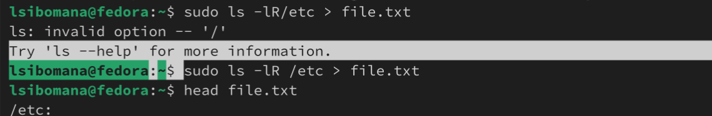{#fig:001 width=70%}

## Перенаправление ввода-вывода

С помощью head я проверяю ,что в файл записалась названия файлов, содержащихся в каталоге /etc:

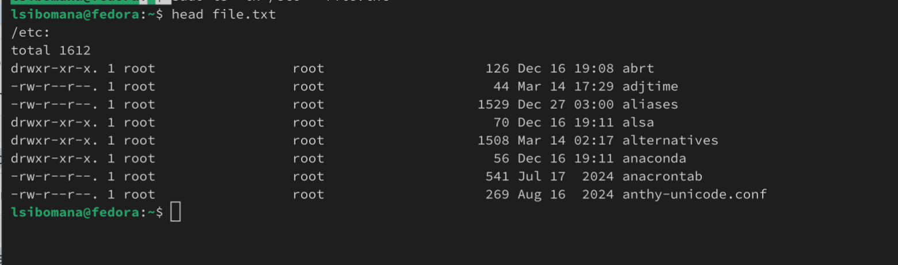{#fig:002 width=70%}

## Перенаправление ввода-вывода

В file.txt добавляю названия файлов, из домашнего каталога используя ls -lR /etc >> file.txt:

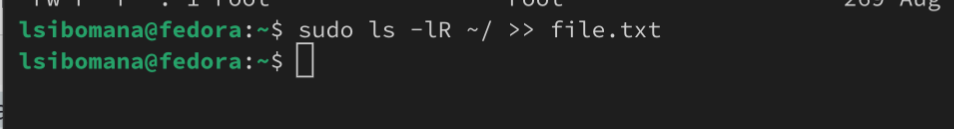{#fig:003 width=70%}

# Поиск файлов

Вывожу имена всех файлов из file.txt, имеющих расширение .conf с помощью grep: 

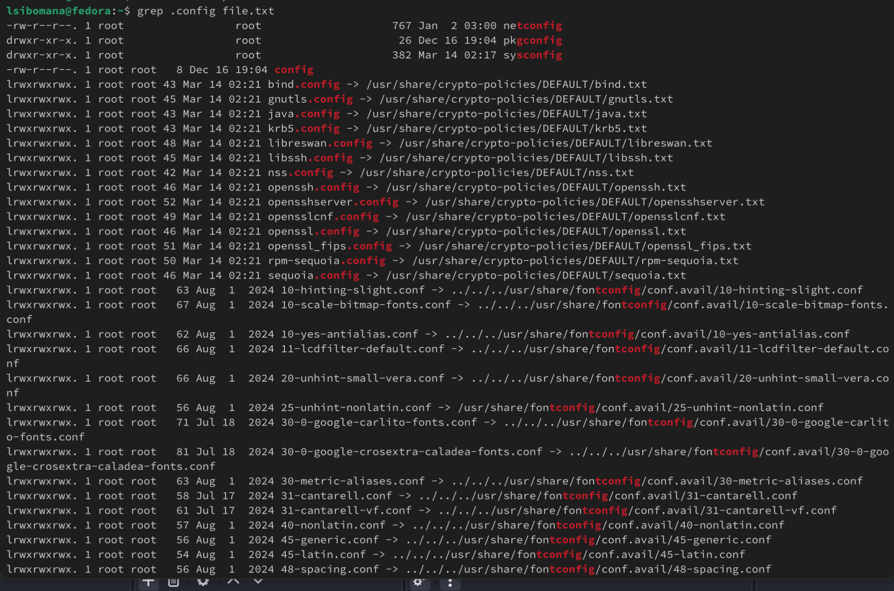{#fig:004 width=70%}

## Поиск файлов

Затем запишиу их в новый текстовой файл conf.txt (grep .conf file.txt > conf.txt) и проверяю с помощью head:

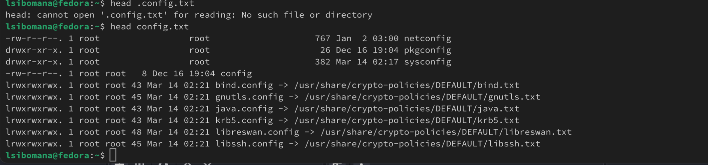{#fig:005 width=70%}

## Поиск файлов

Чтобы определить, какие файлы в домашнем каталоге имеют имена, начинавшиеся с символа "c", использую find ~ -name "c*" print ; ~ обозначается домашний каталог, -name (имя файлов) "с *" строка символов, определяющая имя файла и print выводит результаты на экране:

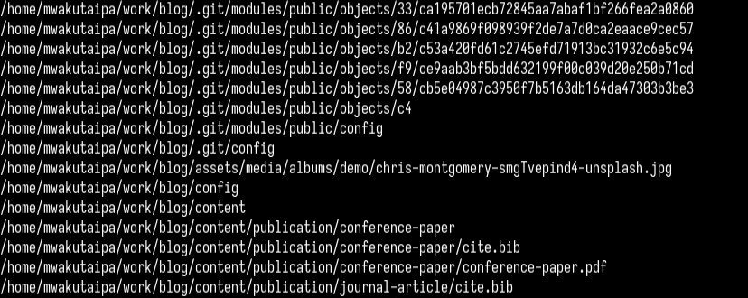{#fig:006 width=70%}

## Поиск файлов

Также можно это действие выполнить используя ls -lR | grep "c*"

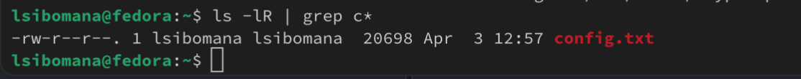{#fig:007 width=70%}

## Просмотр запущенных процессов

В фоновом режиме запускаю процесс, который будет записывать в файл ~/logfile файлы, имена которых начинаются с log:

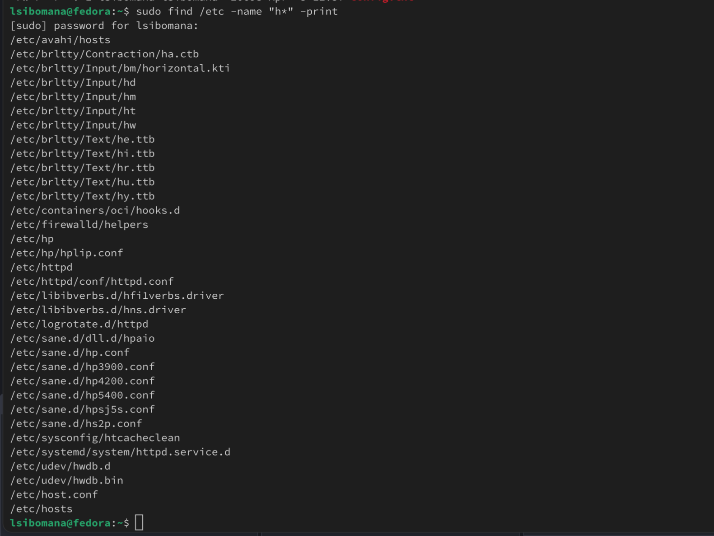{#fig:009 width=70%}

## Просмотр запущенных процессов

Запускаю из консоли в фоновом режиме редактор gedit указывая &:

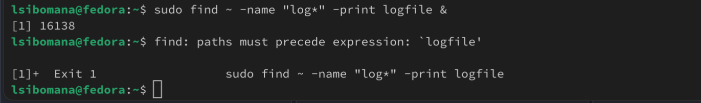{#fig:0011 width=70%}

## Просмотр запущенных процессов

Используя команду ps, конвейер и фильтр grep, определяю идентификатор процесса gedit (3576):

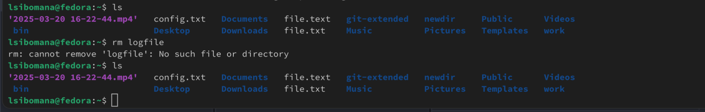{#fig:0013 width=70%}

## Просмотр запущенных процессов

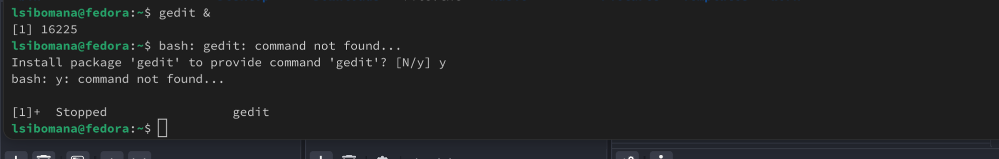{#fig:0014 width=70%}

## Просмотр запущенных процессов

С помощью man прочитала справку команды kill и использую её для завершения процесса gedit:

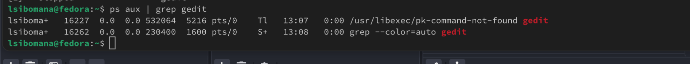{#fig:0015 width=70%}

## Просмотр запущенных процессов

Используя df -vi я вывожу информацию об инодах и вижу сколько свободного места у моей системы:

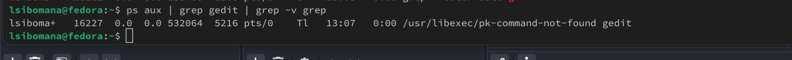{#fig:0018 width=70%}

## Просмотр запущенных процессов

Используя du -a вижу сколько места занимают файлы в директории Загрузки:

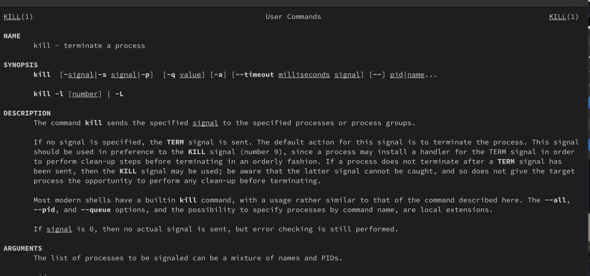{#fig:0019 width=70%}

## Поиск файлов

Воспользовавшись справкой команды find и аргумент d, вывожу всех директорий, имеющихся в домашнем каталоге:

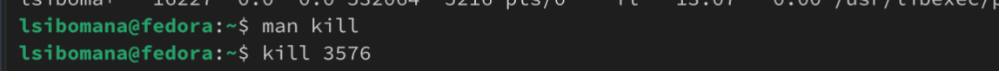{#fig:0020 width=70%}

## Поиск файлов

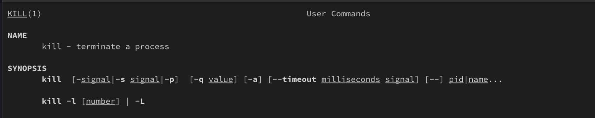{#fig:0021 width=70%}

# Выводы

При выполнение данной работы я ознакомилась с инструментами поиска файлов и фильтрации текстовых данных. Также приобрела практические навыки по управлению процессами и по проверке использования диска по обслуживанию файловых систем.

