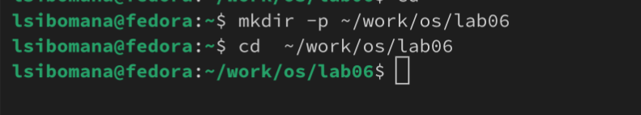
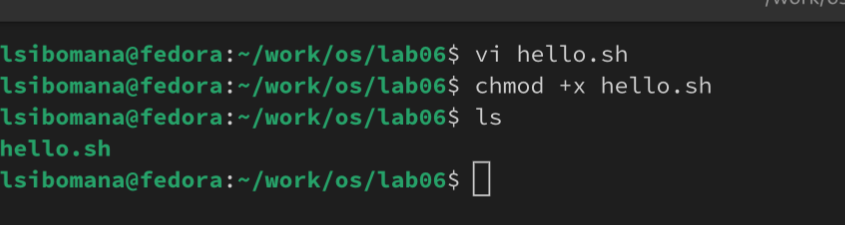
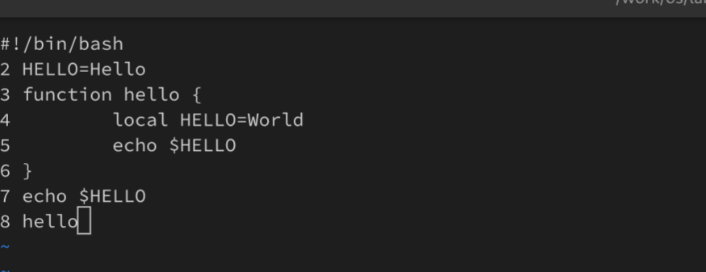
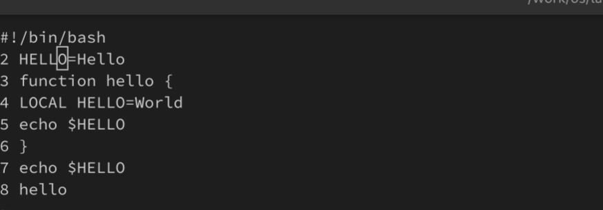
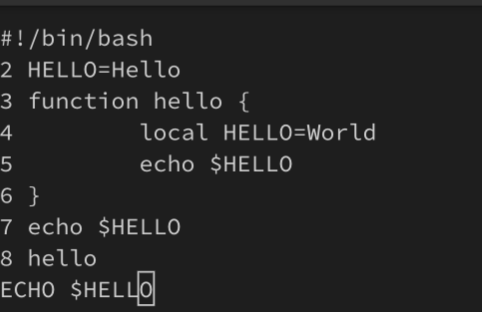

---
## Front matter
lang: ru-RU
title: Презентация по лабораторной работе №10
subtitle: Текстовый редактор vi
author:
  - СИБОМАНА Ламек.
institute:
  - Российский университет дружбы народов, Москва, Россия
date: №_ апреля 202:

## i18n babel
babel-lang: russian
babel-otherlangs: english

## Formatting pdf
toc: false
toc-title: Содержание
slide_level: 2
aspectratio: 169
section-titles: true
theme: metropolis
header-includes:
 - \metroset{progressbar=frametitle,sectionpage=progressbar,numbering=fraction}
 - '\makeatletter'
 - '\beamer@ignorenonframefalse'
 - '\makeatother'
---

# Информация

## Докладчик

:::::::::::::: {.columns align=center}
::: {.column width="70%"}

  * СИБОМАНА Ламек
  * Студентка НКА 03-24
  * факультет физико-математичесих 
  * Российский университет дружбы народов
  * [1032249044@rudn.ru](mailto:1032249044@rudn.ru)
  * <https://lamecky.github.io/ru/>

:::
::: {.column width="30%"}
:::
::::::::::::::

# Вводная часть

## Цели и задачи

- Получить практические навыки работы с редактором vi
- Выполнить упражнения, используя команды vi.

## Что такое vi?

В большинстве дистрибутивов Linux в качестве текстового редактора по умолчанию устанавливается интерактивный экранный редактор vi (Visual display editor).
Редактор vi имеет три режима работы:
– командный режим 
– режим вставки 
– режим последней (или командной) строки 

# Работа с vi

## Создание нового файла с использованием vi

```
vi hello.sh
```
{#fig:001 width=50%}

## Создание нового файла с использованием vi

: w q — записать изменения в файл и выйти из vi; : q — выйти из редактора vi; : q ! — выйти из редактора без записи;

{#fig:003 width=20%}

## Создание нового файла с использованием vi

{#fig:004 width=50%}

## Редактирование существующего файла

x — удалить один символ в буфер; d w — удалить одно слово в буфер; d $ — удалить в буфер текст от курсора до конца строки; d 0 — удалить в буфер текст от начала строки до позиции курсора; d d — удалить в буфер одну строку; n d d — удалить в буфер n строк

{#fig:008 width=50%}

## Редактирование существующего файла

{#fig:005 width=50%}

## Редактирование существующего файла

{#fig:009 width=50%}

## Редактирование существующего файла

Опции редактора vi позволяют настроить рабочую среду. 
– : set all — вывести полный список опций;
– : set nu — вывести номера строк;
– : set list — вывести невидимые символы;
– : set ic — не учитывать при поиске, является ли символ прописным или строчным.


