---
## Front matter
lang: ru-RU
title: Презентация по лабораторной работе №11
subtitle: Текстовый редактор emacs
author:
  - СИБОМАНА Л.
institute:
  - Российский университет дружбы народов, Москва, Россия
date: 24 Апреля 2025

## i18n babel
babel-lang: russian
babel-otherlangs: english

## Formatting pdf
toc: false
toc-title: Содержание
slide_level: 2
aspectratio: 169
section-titles: true
theme: metropolis
header-includes:
 - \metroset{progressbar=frametitle,sectionpage=progressbar,numbering=fraction}
 - '\makeatletter'
 - '\beamer@ignorenonframefalse'
 - '\makeatother'
---

# Информация

## Докладчик

:::::::::::::: {.columns align=center}
::: {.column width="70%"}

  * Вакутайпа Милдред
  * студентка НКА 03-25
  * факультет физико-математических и естественных наук
  * Российский университет дружбы народов
  * [1032249044@rudn.ru](mailto:1032249044@rudn.ru)
  * <https://lamecky.github.io/ru/>

:::
::: 
:::
::::::::::::::

# Цель работы

Получить практические навыки работы с редактором Emacs.

## Установка Emacs

Для данной работы, мне надо была установить Emacs:

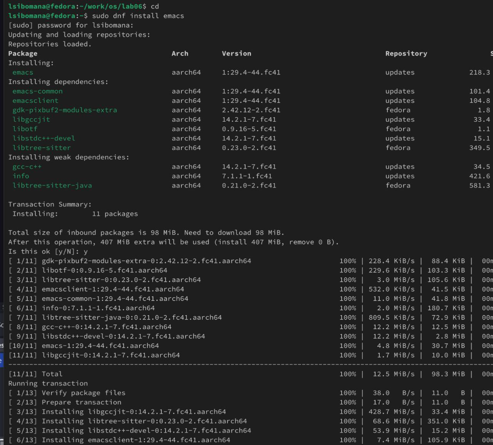{#fig:001 width=70%}

## Основные кманды с редактором

Выполнив Emacs в командной строке, я открыла текстовый редактор:

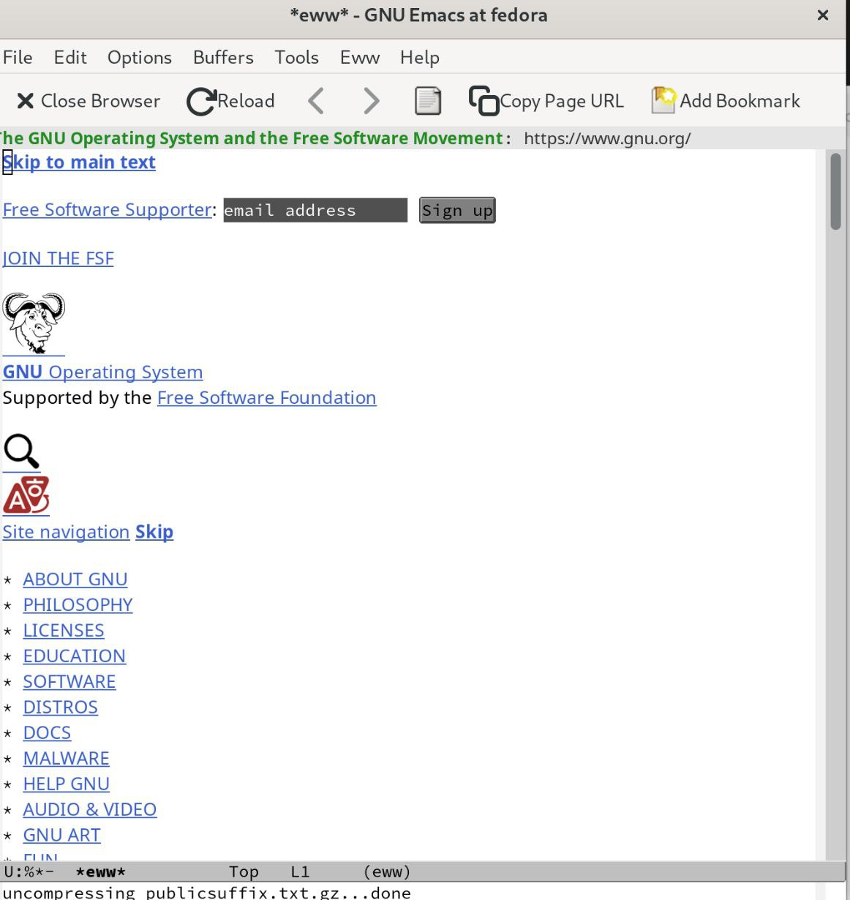{#fig:002 width=70%}

## Основные кманды с редактором

С помощью комбинации Ctrl-x Ctrl-f, создала файл lab07.sh:

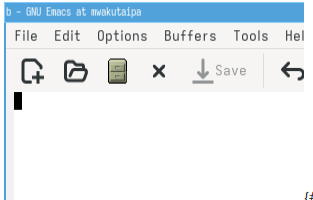{#fig:003 width=70%}

## Основные кманды с редактором

Я сохранила файл с помощью комбинации Ctrl-x Ctrl-s:

{#fig:004 width=70%}

## Основные кманды с редактором

Вырезать целую строку (С-k):

{#fig:005 width=70%}

## Основные кманды с редактором

С помощью C-y вставила эту строку в конец файла:

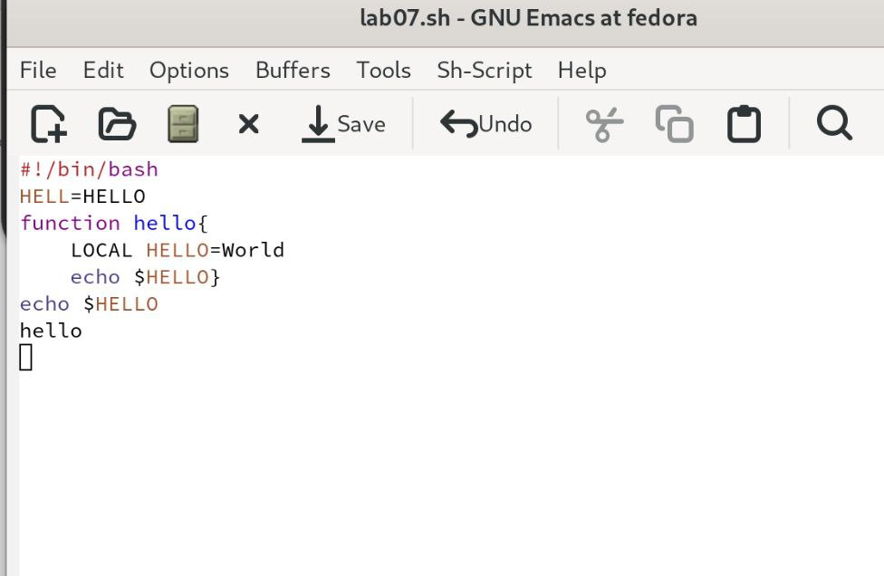{#fig:006 width=70%}

## Основные кманды с редактором

Выделила область текста (C-space):

{#fig:007 width=70%}

## Основные кманды с редактором

Скопировала область в буфер обмена (M-w) и вставила ее в конец файла:

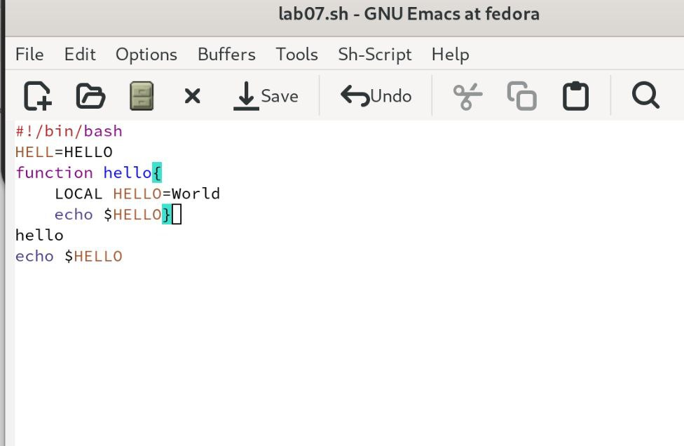{#fig:008 width=70%}

## Основные кманды с редактором

Выделила эту же область и на этот раз вырезала её (C-w):

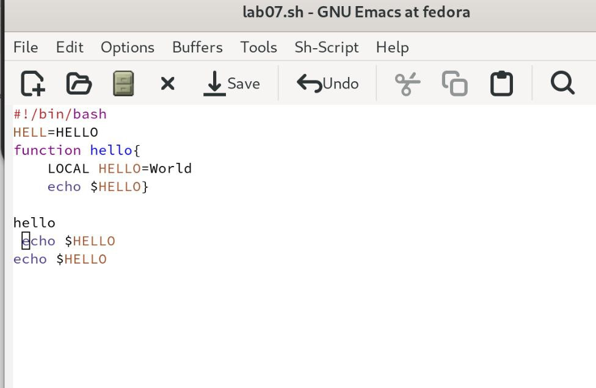{#fig:009 width=70%}

## Основные кманды с редактором

С помощью C-/ отменила последнее действие:

{#fig:0010 width=70%}

## Основные кманды с редактором

С помощью C-a можно переместить курсор в начало строки. С помощью C-e переместила курсор в конец строки:

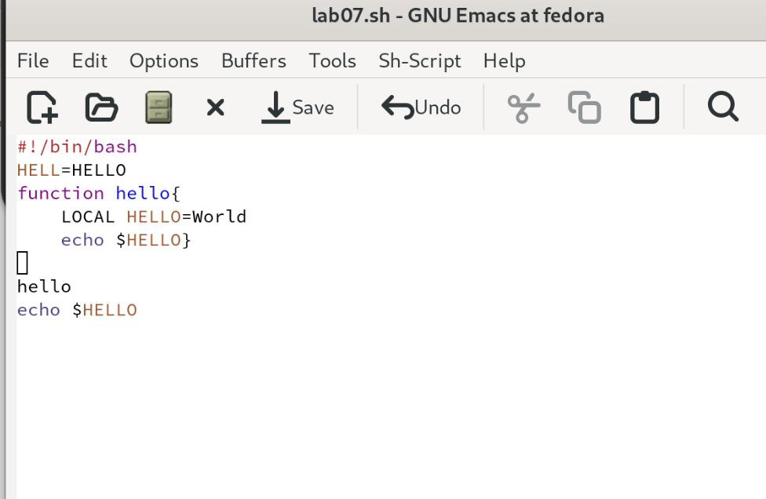{#fig:0012 width=70%}

## Основные кманды с редактором

Переместила курсор в начало и конец буфера с помощью M-< и M-> соответственно:

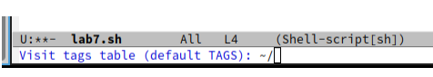{#fig:0013 width=70%}

## Основные кманды с редактором

Выводила список активных буферов на экран с помощью C-x C-b:

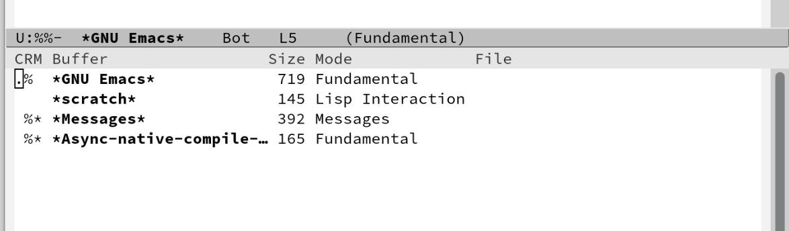{#fig:0014 width=70%}

## Основные кманды с редактором

С помощью C-x o переместилась во вновь открытое окно со списком открытых буферов и переключилась на другой буфер:

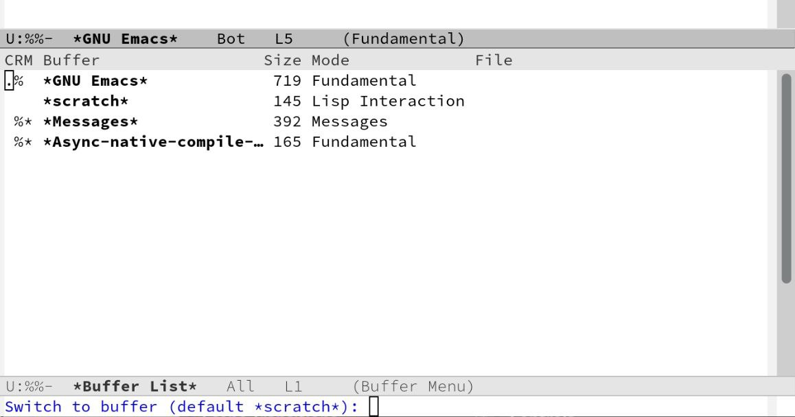{#fig:0015 width=70%}

## Основные кманды с редактором

С помощью C-x 0 закрыла окно со списком открытых буферов:

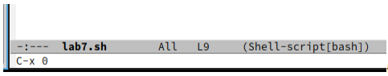{#fig:0016 width=70%}

## Основные кманды с редактором

Без вывода списка буферов, я переключилась между буферами:

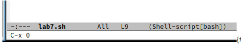{#fig:0017 width=70%}

## Основные кманды с редактором

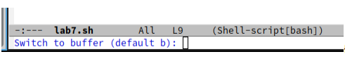{#fig:0018 width=70%}

## Основные кманды с редактором

Поделила фрейм на 4 части. Сначала я разделила фрейм на два окна по вертикали (C-x 3), а затем каждое из этих окон на две части по горизонтали (C-x 2):

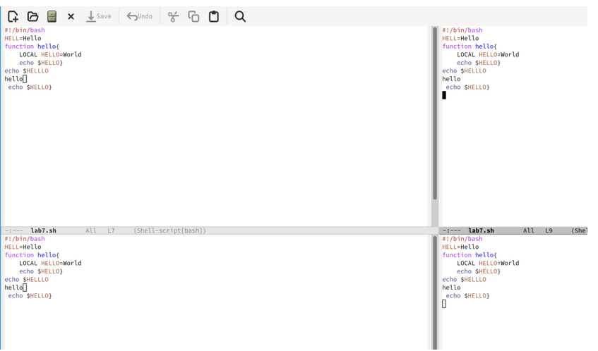{#fig:0019 width=70%}

## Основные кманды с редактором

В каждом из четырёх созданных окон открыла новый буфер: 

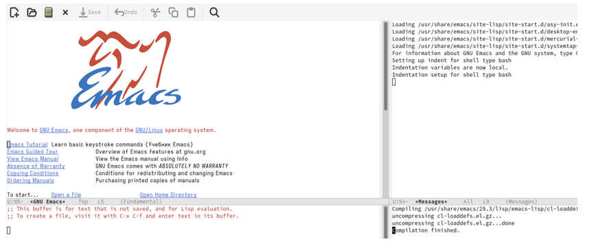{#fig:0020 width=70%}

## Основные кманды с редактором

Переключилась в режим поиска (C-s) и искала Indent:

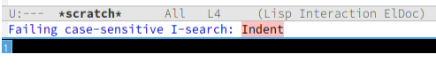{#fig:0021 width=70%}

## Основные кманды с редактором

Переключалась между результатами поиска, нажимая C-s и вышла из режима поиска, нажав C-g:

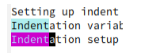{#fig:0022 width=70%}

## Основные кманды с редактором

Перешла в режим поиска и замены (M-% или M-x query replace):

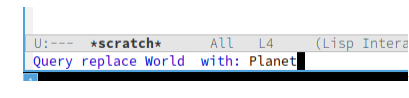{#fig:0023 width=70%}

## Основные кманды с редактором

Нажав M-s o, я использовала другой режим поиска. Он отличается от предыдущего тем, что выводит результаты поиска в новом окне:

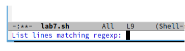{#fig:0024 width=70%}

## Основные кманды с редактором

{#fig:0025 width=70%}

# Выводы

При выполнение данной работы я получила практические навыки работы с Emacs.
